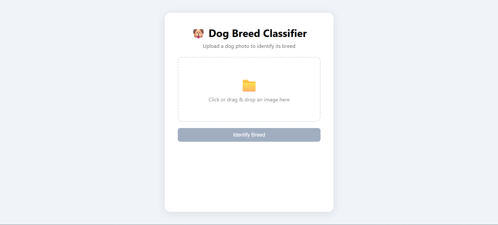

# Dog Breed Classifier

A deep learning web app that identifies dog breeds from images.
Built as a college project to learn CNN and image processing.

## Features
- Classifies 10 dog breeds
- Shows Top 3 predictions with confidence scores
- Simple drag & drop web interface

## Model
- Architecture: EfficientNet-B0 (Transfer Learning)
- Dataset: 100 images × 10 breeds (custom)
- Framework: PyTorch

## Supported Breeds
- (List your 10 breeds here)

## Tech Stack
| Layer     | Tech                |
|-----------|---------------------|
| Model     | PyTorch + EfficientNet-B0 |
| Backend   | Flask (Python)      |
| Frontend  | HTML + CSS + JS     |

## How to Run

### 1. Clone the repo
```bash
git clone https://github.com/yourusername/dog-breed-classifier.git
cd dog-breed-classifier
```

### 2. Install dependencies
```bash
pip install -r requirements.txt
```

### 3. Run the app
```bash
python app.py
```

### 4. Open browser
http://localhost:5000


## Project Structure
dog_breed_classifier/
model/
train.py        # Training script
static/
style.css
script.js
templates/
index.html
app.py            # Flask backend
model.pth         # Trained model
requirements.txt
## Model Performance
- Validation Accuracy: 97%
                            precision    recall  f1-score   support

                    Beagle       1.00      1.00      1.00        10
                     Boxer       1.00      1.00      1.00        10
                   Bulldog       1.00      0.90      0.95        10
                 Dachshund       0.91      1.00      0.95        10
           German_Shepherd       1.00      0.90      0.95        10
          Golden_Retriever       1.00      0.90      0.95        10
        Labrador_Retriever       1.00      1.00      1.00        10
                    Poodle       1.00      1.00      1.00        10
                Rottweiler       1.00      1.00      1.00        10
         Yorkshire_Terrier       0.83      1.00      0.91        10

                  accuracy                           0.97       100
                 macro avg       0.97      0.97      0.97       100
              weighted avg       0.97      0.97      0.97       100

## Demo


## Author
Athavan S — College Project
